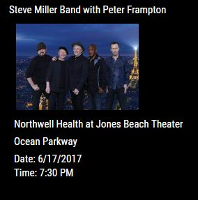
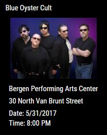
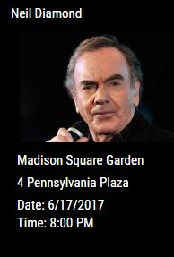
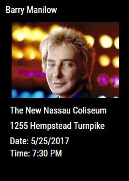
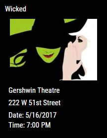
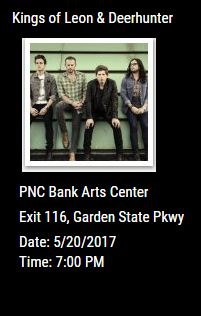

## MMM-Events
* Rotation of upcoming events for your city.
* Never miss a show because you didn't know about it!
* Concerts and Tour Dates, Performing Arts, Art Galleries & Exhibits, Comedy Shows, Food and Drink, Sports, and more.

## Examples
Pictures with Frame or noFrame.

, , 

,, 

## Installation

* `git clone https://github.com/mykle1/MMM-Events` into the `~/MagicMirror/modules` directory.
* Get FREE API key --> http://eventful.com/join?goto=http%3A%2F%2Fapi.eventful.com%2Fkeys#/
* Annotated .css file included for your convenience.

## Config.js entry and options

    {
        module: 'MMM-Events',
        position: 'top_left',
        config: {
		city: "New York",	           // Your City
		eventType: "music",		   // Choose from Events List below
		when: "This Week",                 // "All", "Future", "Past", "Today", "Last Week", "This Week", "Next week", and months by name, e.g. "October"
		mode: "noFrame",                   // "Frame" or "noFrame" (around picture)
		apikey: "Your FREE API Key Goes Here",
		rotateInterval: 5 * 60 * 1000,     // New Event Appears every 5 minutes
		useHeader: false,	           // Set to true if you want a header
		header: "",
		animationSpeed: 3000,              // Event fades in and out
		picture: true,                     // true, false = no image
        }
    },
	
## Choose your config.js "eventType" from this list

## Concerts & Tour Dates

* music
* music_blues
* music_classical
* music_country
* music_dance
* music_easy_listening
* music_electronic
* music_folk
* music_jazz
* music_latin
* music_newage
* music_opera
* music_rb
* music_reggae
* music_vocal
* music_rap_hiphop
* music_metal
* music_religious
* music_rock
* music_pop
* music_world
* music_alternative
* music_childrens

## Performing Arts

* performing_arts	
* performing_arts_cabaret
* performing_arts_opera
* performing_arts_dance
* performing_arts_musical
* performing_arts_ballet
* performing_arts_comedy
* performing_arts_theatre

## 	Sports	

* sports				
* sports_autoracing
* sports_dance
* sports_gymnastics
* sports_iceskatingskiing
* sports_softball
* sports_swimmingdiving
* sports_volleyball
* sports_baseball	Sports:
* sports_basketball
* sports_cricket
* sports_football
* sports_golf
* sports_hockey
* sports_rugby
* sports_soccer
* sports_tennis
* sports_wrestling

## Conferences & Tradeshows

* conference	    		  
* conference_career
* conference_convention
* conference_seminar
* conference_talkslectures

## Comedy

* comedy

## Education       	         

* learning_education		
* learning_education_classworkshop

## Kids & Family

* family_fun_kids 

## Festivals		
	
* festivals_parades		
* festivals_parades_circus
* festivals_parades_festival
* festivals_parades_fairs
* festivals_parades_parade

## Film

* movies_film
* movies_film_filmfestival

## Food & Drink

* food				
* food_beer
* food_wine
* food_farmersmarket
* food_tastings

## Fundraising & Charity

* fundraisers			
* fundraisers_blooddrive
* fundraisers_volunteer

## Art Galleries & Exhibits

* art				
* art_antiques
* art_painting
* art_photography
* art_artexhibits
* art_artsandcrafts
* art_fashion

## Health & Wellness

* support				
* support_fitness
* support_seniorhealth
* support_support
* support_yoga

## Holiday	

* holiday	

## Literary & Books			

* books				
* books_poetry

## Museums & Attractions

* attractions	

## Neighborhood		

* community			
* community_library
* community_holiday
* community_seasonal

## Business & Networking

* business

## 	Nightlife & Singles		

* singles_social			
* singles_social_trivianight
* singles_social_comedy
* singles_social_bars
* singles_social_dating
* singles_social_karaoke
* singles_social_openmic

## University & Alumni

* schools_alumni

## 	Organizations & Meetups	

* clubs_associations

## Outdoors & Recreation	

* outdoors_recreation	
* outdoors_recreation_cycling
* outdoors_recreation_hiking
* outdoors_recreation_nature
* outdoors_recreation_running

## Pets

* animals			
* animals_cats
* animals_dogs

## Politics & Activism

* politics_activism

##	Sales & Retail

* sales				
* sales_auction
* sales_craftshow
* sales_fleamarket
* sales_yardsale
* sales_retail

## Science

* science

## 	Religion & Spirituality		

* religion_spirituality

## Technology

* technology			
* technology_computer
